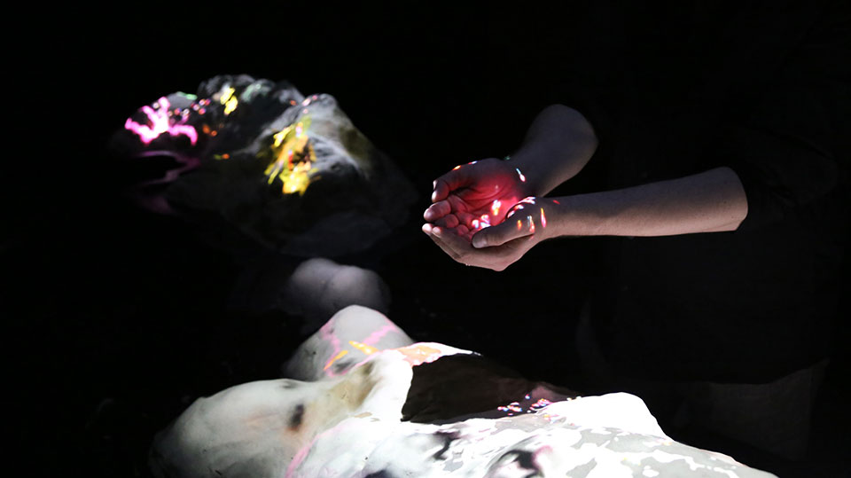

# The Alice Lab

The Alice Lab's program of interdisciplinary research-creation applies a deep commitment to the open- endedness of computation—as an art material—toward technologies of artificial intelligence within immersive mixed reality. The research and training program will result in new software for artists to co-create immersive worlds—as art installations—from within the worlds themselves. As collaborative improvisations enacted with the whole body, this will radically change how we sculpt complex forms and behaviours. Moreover, these worlds will be more responsive, playful, and curious. Disseminated in public venues, they will share a different conception of the cohabitation of human and artificial beings.

The Alice Lab is directed by Graham Wakefield, Canada Research Chair & Associate Professor, School of the Arts, Media, Performance & Design, York University   
[Academic profile at York University](https://ampd.yorku.ca/profile/graham-wakefield/)  
[Canada Research Chair profile](https://www.chairs-chaires.gc.ca/chairholders-titulaires/profile-eng.aspx?profileId=3488)    
[Artist profile in Artificial Nature](https://artificialnature.net/#tab-artists)

## Research Program

Computationally-infused technology now saturates our living environment and increasingly shapes our decisions and lives, and this technology is becoming more visually, sonically, and spatially aware. It is common to think of computation as a tool for solving a problem, or a machine for achieving a given task, or perhaps merely a platform to render and disseminate pre-given content. But such utilitarian perspectives miss a fascinating and fundamental capacity of computation–that it can continually and interactively rewrite itself into being something else–which is a characteristically creative capacity it shares with nature. (Moreover, adhering to pre-given goals and design for exploitation risks infusing unwelcome biases of hidden stakeholders–as evident in current debates around Artificial Intelligence.) In contrast, the central research program for the proposed renewal of the CRC asks: Can we use this mutability of computation to create environments that are more abundantly open, explorable, playful, and collaborative in meaningfully rewarding ways? Can we use immersive technologies, including Virtual Reality, Augmented Reality, and Mixed Reality, sometimes referred to collectively as “XR”, to build toward such futures and to place artists and the wider public at the heart of how they are shaped? The Canada Research Chair program in **Computational Worldmaking** at the Alice Lab (2014-2025) tackles these questions from each end of the human-machine spectrum via two concurrent research streams of **Improvising Worlds** and **Curious Worlds.** The former places artists in the full context of immersive works as they rewrite them in-place; the latter develops artificial agents that can rewrite themselves to be more curious, playful, and creative with us. 

## Publications

[ResearchGate](https://www.researchgate.net/profile/Graham-Wakefield)

Graham Wakefield, Gregory Taylor. [Generating Sound & Organizing Time: Thinking with gen~ Book 1” Cycling ‘74, November 2022.](https://cycling74.com/books/go). *[5/5 stars on GoodReads](https://www.goodreads.com/book/show/63213658-generating-sound-organizing-time), [4.8/5.0 on Amazon](https://www.amazon.ca/Generating-Sound-Organizing-Time-Thinking/dp/1732590311), [Interview on PerfectCircuit](https://www.perfectcircuit.com/signal/graham-wakefield-generating-sound-organizing-time-interview)*

- Haru Hyunkyung Ji and Graham Wakefield. “We Are Entanglement.” In Proceedings of SIGGRAPH Art Gallery. ACM Digital Library, Vancouver, Canada, 2025 (to appear).
- Haru Hyunkyung Ji and Graham Wakefield. “Entanglement: an immersive art of an engagement with non-conscious intelligence.” In Proceedings of the International Symposium of Electronic Art (Seoul, Korea). 2025.
- Iason Paterakis, Nefeli Manoudaki, Graham Wakefield, Haru Ji, Ryan Millett, Diarmid Flatley, Weihao Qiu and Marcos Novak. “Composing Complexity: A Case Study of Integrating Multi-Layered Audio-Visual Systems in Large-Scale Interactive Installations.” In Proceedings of the International Symposium of Electronic Art (Seoul, Korea). 2025.
- Haru (Hyunkyung) Ji, Graham Wakefield. “지하루 & 그라함 웨이크필드” Re:Spect, Korean Media Art Since 2000. December 2024. Edited by Kim Soo-jin, Lee Tae-won.  ISBN 979-11-94299-16-5 (93600)
- Michael Palumbo, Graham Wakefield. “From ‘What if?’ to ‘What Diff?’ and Back Again. The Modular Synthesis: Patching Machines and People. Ed. Ezra Taboul, Andreas Kitzmann, Einar Engstrom. Taylor & Francis/Focal Press, April 2024. 
- Haru (Hyunkyung) Ji, Graham Wakefield. "Conservation of Shadows." In Proceedings of SIGGRAPH Art Gallery. ACM Digital Library, Los Angeles, USA, 2023. 
- Graham Wakefield, Haru Ji. “Creative Artificial Intelligence within the Artificial Life Installation Infranet”. In Proceedings of the international Electronic Visualisation & the Arts conference, (online) London, UK, 2021.
- Graham Wakefield. [A streamlined workflow from Max/gen~ to modular hardware](http://nime2021.org/program/#/paper/172). In Proceedings of the International Conference on New Interfaces for Musical Expression, (online) NYU Shanghai, China, 2021. 
- Graham Wakefield, Michael Palumbo, Alexander Zonta. “Affordances and Constraints of Modular Synthesis in Virtual Reality”. In Proceedings of the International Conference on New Interfaces for Musical Expression, Birmingham, UK. 2020.
- Sarah Vollmer. 2019. Curious Creatures: a living virtual research-creation lab. In 6th International Conference on Movement and Computing (MOCO ’19), October 10–12, 2019, Tempe, AZ, USA. ACM, New York, NY, USA, 4 pages. https://doi.org/10.1145/3347122.3371379
- Wakefield, Graham, and Haru Hyunkyung Ji. "Infranet: A Geospatial Data-Driven Neuro-Evolutionary Artwork." In 2019 IEEE VIS Arts Program (VISAP), pp. 1-7. IEEE, 2019.
- Michael Palumbo, Alexander Zonta, Graham Wakefield. "Modular reality: Analogues of patching in immersive space". Journal of New Music Research, [DOI: 10.1080/09298215.2019.1706583](https://doi.org/10.1080/09298215.2019.1706583). Taylor and Francis, 10 Jan 2020.
- Wakefield, Graham, and Haru Hyunkyung Ji. ["Infranet: A Geospatial Data-Driven Neuro-Evolutionary Artwork."](https://ieeexplore.ieee.org/document/8900903) In 2019 IEEE VIS Arts Program (VISAP), pp. 1-7. IEEE, 2019.
- Haru (Hyunkyung) Ji, Graham Wakefield. Conservation of Shadows: Site-Specific Shared Physicality. Proceedings of ISEA 2019.
- Haru (Hyunkyung) Ji, Graham Wakefield. “Selected Artificial Natures, 2017-2018” In Living Architecture Systems Group White Papers II. Riverside Architectural Press, 2019. March 2019. 
- Haru (Hyunkyung) Ji, Graham Wakefield. ["Inhabitat: an Imaginary Ecosystem in a Children’s Science Museum."](https://www.leonardo.info/journal-issue/leonardo/51/4) Leonardo Vol. 51, No. 4, pp. 343–348, 2018. (Leonardo 50th anniversary issue, SIGGRAPH 2018 special issue)
- Graham Wakefield. "Open Worlds: Bergson And Computational Ontology." In [Worldmaking as Techné](http://worldmakingastechne.net/): Exploring Worlds of Participatory Art, Architecture, and Music, edited by Alberto de Campo, Mark-David Hosale, Sana Murrani. Riverside Architectural Press, 2018.
- Charles Roberts, Graham Wakefield. "Tensions & Techniques in Live Coding Performance." In The Oxford Handbook of Algorithmic Music, edited by Roger Dean, Alex McLean. Oxford University Press, February 2018.
- Charles Roberts, Graham Wakefield, Matthew Wright. "Reflections on Synthesis and Instrument Design for the Browser” and “The Web Browser As Synthesizer And Interface." In The NIME Reader. Springer Verlag, Jan 2018.
- Haru (Hyunkyung) Ji, Graham Wakefield. ["Biotopes Computationnels (Computational Biotopes)"](https://www.pca-stream.com/fr/articles/haru-ji-graham-wakefield-biotopes-computationnels-110) In Stream 04: Les Paradoxes du vivant (The Paradoxes of the Living), pp. 304-316 Philippe Chiambaretta Architecte, Paris, November 2017.
- Graham Wakefield, Charles Roberts. A Virtual Machine for Live Coding Language Design. Proceedings of the International Conference on New Interfaces for Musical Expression (Copenhagen, Denmark). 2017.
- Charles Roberts, Graham Wakefield. gibberwocky: New Live-Coding Instruments for Musical Performance. Proceedings of the International Conference on New Interfaces for Musical Expression (Copenhagen, Denmark). 2017.
- Sung-A Jang, Graham Wakefield, Sung-Hee Lee. "Incorporating Kinesthetic Creativity and Gestural Play into Immersive Modeling." In Proceedings of the 4th International Conference on Motion Computing (London, United Kingdom), 17-24. ACM, June, 2017.
- Haru (Hyunkyung) Ji, Graham Wakefield. "Recent Realizations of Artificial Nature." In Living Architecture Systems Group White Papers. Riverside Architectural Press, 2016.
- Charles Roberts, Graham Wakefield. "Live Coding the Digital Audio Workstation." In Proceedings of the International Conference on Live Coding (Hamilton, Canada). October, 2016.
- Seunghun Kim, Graham Wakefield, Juhan Nam. "Augmenting Environmental Interaction in Audio Feedback Systems." Applied Sciences 6, no. 5 (May, 2016): 125.
- Haru (Hyunkyung) Ji, Graham Wakefield. "Endogenous Biologically Inspired Art of Complex Systems." Computer Graphics and Applications 36, no. 1 (January, 2016): 16-21. IEEE Computer Society.
- Seunghun Kim, Changheun Oh, Graham Wakefield, Juhan Nam. "Sonic Participation in the Evolving Audio Feedback System." In Proceedings of the International Symposium of Electronic Art (Hong Kong). 2016.
- Charles Roberts, Graham Wakefield, Matthew Wright, JoAnn Kuchera-Morin. "Designing Musical Instruments for the Browser." Computer Music Journal , no. 1 (March, 2015): 27-40. MIT Press.
- Seunghun Kim, Juhan Nam, Graham Wakefield. "Toward Certain Sonic Properties of an Audio Feedback System by Evolutionary Control of Second-Order Structures." In Lecture Notes in Computer Science 9027 Evolutionary and Biologically Inspired Music, Sound, Art and Design (The 4th International Conference EvoMUSART, Copenhagen), 113-124. Springer International Publishing, , 2015.
- Haru (Hyunkyung) Ji, Graham Wakefield. "Endogenous Biologically-Inspired Visualization Immersed Within an Art of Complex Systems." In Proceedings of the IEEE VIS Arts Program (Chicago, USA), 30-37. University of Illinois at Chicago, October, 2015.
- Seunghun Kim, Graham Wakefield, Juhan Nam. "Augmenting Room Acoustics and System Interaction for Intentional Control of Audio Feedback." In Proceedings of the International Computer Music Conference (Denton, USA). University of North Texas, September, 2015.
- So Jung Bahng, Patrick Hutchings, Yoo Doo Won, Graham Wakefield. "Generative Spatial Montage with Multi-Layered Screens in \"Lost Fragments of Night\"." In Proceedings of the International Symposium on Electronic Arts (Dubai). The Inter-Society for the Electronic Arts, October, 2014. 

## Exhibitions

- We are Entanglement. Artificial Nature: Haru (Hyunkyung) Ji and Graham Wakefield. SIGGRAPH Art Gallery, Vancouver Convention Centre, Vancouver, Canada. 2025-08-10 - 2025-08-14. 
- We are Entanglement. Artificial Nature: Haru (Hyunkyung) Ji and Graham Wakefield. International Symposium of Electronic Arts (ISEA), Seoul Arts Center, Seoul, Korea. 2025-05-23 to 2025-05-29. 
- Delicate Self. Artificial Nature: Haru (Hyunkyung) Ji and Graham Wakefield. At four venues as part of Digital Subculture: Digital Abstraction and the RoofTop Busan Festival. Busan, Korea. 2025-04-23. - 2025-06-29
  - Busan Museum of Art Outdoor Sculpture Garden LED cube.
  - Lower Senior Town LHOUR Senior. LED facade.
  - Ucaro Automobile (Haeundae Building). LED facade.
  - 3rd floor art hall of Gimhae Airport Domestic Terminal.
- Delicate Self. Artificial Nature: Haru (Hyunkyung) Ji and Graham Wakefield. Permanent exhibit: Somansa building LED wall, Pangyo, Korea, from February 2025. 
- Entanglement. Artificial Nature: Haru (Hyunkyung) Ji and Graham Wakefield. Digital Subculture: Digital Abstraction, Time Cubism Busan Cultural Center, Korea. 2024-04-18. - 2024-05-10
- Entanglement. Artificial Nature: Haru (Hyunkyung) Ji and Graham Wakefield. flashDRIVE, Inter/Access, Toronto, Canada. 2025-05-01 - 2025-05-17.  Opening/fundraising event for Toronto’s newly opened digital arts venue.
- A Thousandfold Drift. Artificial Nature: Haru (Hyunkyung) Ji and Graham Wakefield. Jeju Biennale: “The Drift of Apagi”. Jeju Museum of Contemporary Art. Jeju Island, Korea. 2024-11-26 to 2025-02-16.
- We are Entanglement. Artificial Nature: Haru (Hyunkyung) Ji and Graham Wakefield. Entangled Dimensions: Art in the Age of Neural Media. Invited artists. The Illuminarium immersive venue, Toronto. 2024-10-08 to 2024-10-09.
- Entanglement. Artificial Nature: Haru (Hyunkyung) Ji and Graham Wakefield. Selected Series of XR Lab, Review Exhibition. XRLab, Ulsan Museum of Art, Korea. 2024-02-08 - 2024-05-19 (Invited re-exhibit, selected among three best works in the space since its opening). 
- Entanglement. Artificial Nature: Haru (Hyunkyung) Ji and Graham Wakefield. [Seoul Light Winter Festival Gwanghwamun Square. National Museum of Korean Contemporary History, outdoor LED media facade (90m x 9m, 8192x940 pixels)](https://eng.seoullightgwanghwamun.com/home/facade_museum.html) 2023-12-15 - 2024-01-21.  
- Entanglement. Artificial Nature: Haru (Hyunkyung) Ji and Graham Wakefield. NeurIPS (Creative AI track). Thirty-seventh Conference on Neural Information Processing Systems. New Orleans, 2023-12-11 to 2023-12-15. 
- We are Entanglement. Artificial Nature: Haru (Hyunkyung) Ji and Graham Wakefield. Signals, Vancouver International Film Festival (VIFF) & DigiBC. Bentall Gallery, Vancouver, Canada. 2023-10-01 - 2023-10-07. 
- Infranet. Artificial Nature: Haru (Hyunkyung) Ji and Graham Wakefield. Cabinet of the Ephemeral–Collecting Media Art. Art Center Nabi, Seoul, Korea. 2023-09-01 - 2023-09-27.  
- Entanglement. Artificial Nature: Haru (Hyunkyung) Ji and Graham Wakefield. Data Distorted (Digital Silence), XRLab, Ulsan Museum of Art, Korea. 2023-07-04 - 2023-08-21.
- Conservation of Shadows: Los Angeles. Artificial Nature: Haru (Hyunkyung) Ji and Graham Wakefield. SIGGRAPH Art Gallery, Los Angeles Convention Centre, USA. (Juried competition, <10% acceptance ratio) 2023-08-06 - 2023-08-10
- Data Ocean (Time Tunnel). [One component layer for a large-scale two-wall projection array (40m x 4.4m per wall) as part of the 50th SIGGRAPH Synaptic Time Tunnel archive data art exhibit, built upon a data archive of all historical SIGGRAPH conferences, organised collectively by teams at Bowling Green University + University of California Santa Barbara, with over $250k funding secured from Autodesk Inc. 15,000 visitors.](https://s2023.siggraph.org/presentation/?id=histc_119&sess=sess421) SIGGRAPH, Los Angeles Convention Centre, USA. 2023-08-06 - 2023-08-10
- Dendron Alpha. Artificial Nature: Haru (Hyunkyung) Ji and Graham Wakefield. Latent-Ville, Santa Barbara Center for Arts, Science & Technology (SBCAST) and California NanoSystems Institute, USA.  2023-06-01 + 2023-06-09. 
- Conservation of Shadows. Artificial Nature: Haru (Hyunkyung) Ji and Graham Wakefield. Santa Barbara Center for Arts, Science & Technology (SBCAST), USA. 2022-10-06
- Conservation of Shadows in ZKM. Artificial Nature: Haru (Hyunkyung) Ji and Graham Wakefield. [BioMedia (The Age of Media with Life-like Behavior), Center for Art and Media Mediamuseum (ZKM), Karlsruhe, Germany](https://zkm.de/en/exhibition/2021/12/biomedia). 2021-12-18 - 2022-08-28.  
- Infranet. Artificial Nature: Haru (Hyunkyung) Ji and Graham Wakefield. Life, A Sensorium Virtual Exhibition. ISEA 2020, Montreal, Canada. Online due to pandemic. 2020-08-13 to 2020-08-18.
- Infranet:NYC. Artificial Nature: Haru (Hyunkyung) Ji and Graham Wakefield. Techno-imagination: Living Data. Sylvia Wald & Po Kim Art Gallery, Manhattan, New York, USA. 2019-8-1 – 2019-12-06.
- Infanet:Vancouver. Artificial Nature: Haru (Hyunkyung) Ji and Graham Wakefield. IEEE VIS Arts Exhibition, Vancouver Convention Centre, Vancouver, Canada. 2019-10-22 – 2019-10-25.
- Time of Doubles. Artificial Nature: Haru (Hyunkyung) Ji and Graham Wakefield. Spiral Film Philosophy Conference + Open Doors Toronto. Toronto Media Arts Centre. 2019-05-17 - 2019-05-26.
- Endless Current. Artificial Nature: Haru (Hyunkyung) Ji and Graham Wakefield. Spiral Film Philosophy Conference. Toronto Media Arts Centre. 2019-05-17 - 2019-05-18.
- Endless Current. Artificial Nature: Haru (Hyunkyung) Ji and Graham Wakefield. CRAM Research Festival, York University, Toronto. 2019-04-05.
- Conservation of Shadows: Underworld. Artificial Nature: Haru (Hyunkyung) Ji and Graham Wakefield. "Feral Hospitality", Sidewalk Labs, Toronto. 2019-03-02.
- Infranet: Gwangju. Artificial Nature: Haru (Hyunkyung) Ji and Graham Wakefield.  Gwangju Media Art Festival 2018 "Algorithm Society: Birth of The Machine-God", Asia Culture Center (ACC), Gwangju, Korea. 2018-11-28 - 2018-12-7.
- Insuperposition. Artificial Nature: Haru (Hyunkyung) Ji and Graham Wakefield.  Daejeon Bienalle 2018 "Bio", Daejeon Museum of Art, Daejeon, Korea. 2018-07-16 - 2017-10-24. 
- Conservation of Shadows. Artificial Nature: Haru (Hyunkyung) Ji and Graham Wakefield. Requiem for Hybrid Life, Seoul Museum of Art (Chang-go), Seoul, Korea. 2017-10-17 - 2017-10-23 (Curated, International).
- Inhabitat. Artificial Nature: Haru (Hyunkyung) Ji and Graham Wakefield.  Interactive Media Theatre. MOXI Museum of Exploration of Innovation, Santa Barbara, USA.  2017-08-10 - 2018-01-08 (Commissioned, International).
- Portrait. Artificial Nature: Haru (Hyunkyung) Ji and Graham Wakefield.  First Thursday Festival. SBCAST, Santa Barbara, USA.  2017-08-03 (Curated, Local).
- Portrait. Artificial Nature: Haru (Hyunkyung) Ji and Graham Wakefield.  Currents New Media Festival. El Museo Cultural, Santa Fe, USA.  2017-06-09 - 2017-06-25 (Juried, International).
- Endless Current. Artificial Nature: Haru (Hyunkyung) Ji and Graham Wakefield.  SV+VS (Sonifying Visuals+Visualizing Sound). Gallery MUN, Dongdaemun Design Plaza, Seoul, Korea.  2016-08-20 - 2016-09-18 (Curated, International).
- Endless Current. Artificial Nature: Haru (Hyunkyung) Ji and Graham Wakefield.  Currents New Media Festival. El Museo Cultural, and also the Digital Dome at the Institute of American Indian Arts, Santa Fe, USA.  2016-06-10 - 2016-06-26 (Juried, International).
- Live Electronic Music. Graham Wakefield.  Wordless Word. Array Space, Toronto, Canada.  2016-05-10 (Curated, National).
- Time of Doubles. Artificial Nature: Haru (Hyunkyung) Ji and Graham Wakefield.  Globale Renaissance 2.0 - Exo:Evolution. Center for Art and Media (ZKM) Mediamuseum, Karlsruhe, Germany.  2015-10-30 - 2016-02-28 (Curated, International).
- Endless Current. Artificial Nature: Haru (Hyunkyung) Ji and Graham Wakefield.  IEEE VIS Arts Program. LeRoy Neiman Center, School of the Art Institute of Chicago, USA.  2015-10-16 - 2015-10-30 (Juried, International).
- Archipelago. Artificial Nature: Haru (Hyunkyung) Ji and Graham Wakefield.  Seoul Sangsangryok Baljeonso (Imagination Powerhouse). City Hall, Seoul, Korea.  2015-02-16 - 2015-02-27 (Invited re-exhibit, International).
- Archipelago. Artificial Nature: Haru (Hyunkyung) Ji and Graham Wakefield.  Capitaine Futur. La Gat Lyrique, Paris, France.  2014-10-08 - 2015-02-08 (Curated, International).
- Archipelago. Artificial Nature: Haru (Hyunkyung) Ji and Graham Wakefield.  Seoul Sangsangryok Baljeonso (Imagination Powerhouse). City Hall, Seoul, Korea.  2014-10-01 - 2014-10-21 (Juried competition, International).
- Endless Current. Artificial Nature: Haru (Hyunkyung) Ji and Graham Wakefield.  Artience Project Daejeon. Korea Research Institute of Standards and Science, Daejeon, Korea.  2014-08-23 - 2014-09-02 (Curated, National).

## Talks, panels, guest lectures, and workshops

- Graham Wakefield. Computational Worldmaking. 2024 CAU International Metaverse Festival (CIMF), Chung-Ang University, Seoul, Korea. 2024-11-07
- Graham Wakefield & Karl Yerkes. Synth UX Hackathon. University of California Santa Barbara / SBCAST, a four day event along with 19 other universities world-wide, Feb 9 - Feb 12 2024, sponsored by Arturia, Erica Synths, Electrosmith, Cycling ‘74, Superbooth.
- Graham Wakefield. Entanglement. Master of Digital Media talk series, The Creative School, Toronto Metropolitan University: 2023-11-09
- Haru Ji & Graham Wakefield. Conservation of Shadows. SIGGRAPH Digital Arts SPARKS: Artist Talks: 2023-09-29 
- Haru Ji & Graham Wakefield. Conservation of Shadows. SIGGRAPH Artist Talk. 2023-08-06
- Graham Wakefield & Gregory Taylor. [Generating Sound & Organizing Time. Music Hackspace (https://musichackspace.org), London, UK, 2023-05-27.](https://musichackspace.org/product/max-meetup-generating-sound-organizing-time/)  
- Graham Wakefield. Generating Sound & Organizing Time with gen~. CCRMA seminar, Stanford University, 2023-04-12.
- Haru Ji & Graham Wakefield. Data Art and Immersive Artificial Ecologies with examples of Artificial Natures. Translational Data Analytics lectures, Ohio State University 2023-03-08
- Graham Wakefield & Karl Yerkes. Synth UX Hackathon. University of California Santa Barbara / SBCAST, a four day event along with 16 other universities world-wide, Feb 17 - Feb 20 2023, sponsored by Arturia, Electrosmith, Cycling ‘74, Superbooth.
- Graham Wakefield. Generating Sound & Organizing Time with gen~. Media Arts & Technology seminar, University of California Santa Barbara, 2022-12-05.
- Graham Wakefield. Computational Creativity & AI. AIIF (Advanced Imaging & Artificial Intelligence International Festival). Chung-Ang University, Seoul, Korea. Online, 2022-11-05
- Graham Wakefield. Creative AI within the Artificial Life Installation “Infranet” and other Artificial Natures. The Ohio State University ACCAD Data + Trends series. Online, 2022. 
- Graham Wakefield. Computational Creativity. Invited talk, Hong Kong University of Science & Technology (HKUST). 2022-01-25.
- Graham Wakefield. “Prototyping Hybrid Reality Technologies”. Meta/Oculus Reality Labs, 2021-07-27. This keynote event kicked off a workshop week at FRL prototyping audio devices using gen~ & Oopsy software and the Daisy open hardware platform. 
- Graham Wakefield. “Computational Worldmaking in Artificial Nature and the Alice Lab”. Invited Speaker, VRTO (Virtual & Augmented Reality World Conference) Flotilla, Mozilla Hubs online ([https://vrto.spatialized.events](https://vrto.spatialized.events)), 2021-06-04.
- Haru Ji & Graham Wakefield, invited presentation, “Artificial Nature: Immersive Installations of Shared Realities”. School of Arts, Technology & Emerging COmmunication (ATEC) Dean’s Colloquium, ([https://atec.utdallas.edu/event/deans-colloquiumharu-ji-graham-wakefield/](https://atec.utdallas.edu/event/deans-colloquiumharu-ji-graham-wakefield/)), University of Dallas Texas, 2021-05-07. 
- Haru Ji & Graham Wakefield, “Artificial Natures in Shared Realities”. Presenters & panelists, DigitalFUTURES New Media Architecture(s): A Vision for Change in the Arts, Design, & Sciences Panel ([https://youtu.be/JFMgGrnTRgY](https://youtu.be/JFMgGrnTRgY)). Online (Youtube/Bilibili.com), 2021-05-01. 
- Haru Ji & Graham Wakefield, “Artificial Natures // Games of Life”. Guest lecture and workshop, Data+AI+Design lecture series ([http://www.data-ai.design/artificial-nature.html](http://www.data-ai.design/artificial-nature.html)), San Jose State University, 2021-03-12. 
- Haru Ji & Graham Wakefield, Speaker & panelist. [Measuring Computational Creativity. A Workshop for ISEA 2020](https://mcreativeai.github.io/#speakers), Montreal, Canada. 2020-08-18.
- Artist Capsule Video. Infranet for Life, A Sensorium Virtual Exhibition. ISEA 2020, Montreal, Canada. Online 2020-08-13 to 2020-08-18.
- Haru Ji & Graham Wakefield. [Artificial Natures (Artist Talk). Sensilab Seminar Series, Monash University](https://sensilab.monash.edu/forums/haru-ji-graham-wakefield/), Melbourne, Australia (via Zoom). 2020-07-7. 
- Graham Wakefield. Artist Talk, Sensorium Series, York University. 2020-02-15. 
- Haru Ji & Graham Wakefield. Virtual Reality: Endless Current (Artist Talk). Bata Library, Trent University, Oshawa, Ontario, Canada. 2019-11-15
- Haru Ji & Graham Wakefield. Generative Art & A-Life Art based on Artificial Nature (Artist Talk). Chung-Ang University, Seoul, Korea, 2019-07-11.
- Artificial Nature (Artist Talk). [Spiral Film Philosophy conference 2019, "It's Alive! Film/Form/Life"](https://www.facebook.com/spiralfilmphilosophy/). Toronto Media Arts Centre, Canada. 2019-05-17. 
- Live Coding Max with Gibberwocky (Workshop). Expo '74 2019, MASS MOCA, North Adams, USA. 2019-04-28.
- Modular Synthesis in Virtual Reality (Demonstration). Expo '74 2019, MASS MOCA, North Adams, USA. 2019-04-26.
- Graham Wakefield. VR for Researchers. VISTA: Vision Science to Applications, York University, 2018-5-31 - 2018-6-1.
- Artificial Nature (Artist Talk). 307: Feral Hospitality, Sidewalk Labs, Toronto, Canada. 2019-04-02. 
- Live Code a Language as Instrument (Workshop). The International Conference on New Interfaces for Musical Expression, Aalborg University Copenhagen, Denmark, 2017-06-15
- Design a Mini Live Coding Language (Workshop). International Conference on Live Coding, Centre 3 for Print and Media Arts, Hamilton, Canada, 2016-10-12
- Artificial Natures (Artist talk). Weird Reality: Head-Mounted Art && Code, Carnegie Mellon University, Pittsburgh, USA, 2016-10-08
- Interactive Art: Animating Public Space (Panel talk). Media Architecture Summit 2016, oTIFF Bell Lightbox, Toronto, Canada, 2016-09-30
- Computational Art in Mixed Realities (Research talk). Centre for Vision Research Retreat, York Glendon Hall, Toronto, Canada, 2016-09-16
- Computational Worldmaking (Guest lecture). Graduate Seminar, School of Interactive Games & Media, Rochester Institute of Technology, USA, 2016-09-01
- Virtual Reality Worldmaking (Lecture/workshop). Imagination Seminar, Art & Technology program, Sogang University, Korea, 2016-07-15
- Artificial Natures (Guest lecture). Future City Society, SCALe, Korea, 2016-07-13
- Advanced Gen Programming (Workshop). TACIT media studio, Korea, 2016-07-08
- Artificial Natures (Guest lecture). Computational Aesthetics, School of Interactive Games & Media, Rochester Institute of Technology, USA, 2016-03-07
- Data Imaginaries (Artist talk). Leonardo Art Science Evening Rendezvouz (LASER) / Art-Science Salon, Fields Institute, University of Toronto, Canada, 2015-11-19
- Computational Worldmaking (Artist talk). Centre for Vision Research seminar series, York University, Toronto, Canada, 2015-11-06
- Bridging Web-Based Visualization and 3D (Workshop). Canadian Visual Analytics School (CANVAS), York University, Toronto, Canada, 2015-07-28
- Artificial Nature: Mixed-Reality Ecosystem (Construction of Aesthetic Experience) (Forum talk). Asia Pacific Center for Theoretical Physics (APCTP) Science Communication Forum, Korea Astronomy and Space Science Institute, Sobaek Optical Astronomy Observatory, Republic of Korea, 2015.07.08 - 2015.07.10
- Introduction to Artificial Life (Workshop). Seoul Science High School, Korea, 2015-07-06
- Becoming There: Immersed in Computation (Artist talk). Sensorium Lecture Series, York University, Toronto, Canada, 2015-02-24
- Becoming There: Immersed in Computation (Panel). Exploring the Frontiers of Science & Technology, York University, Toronto, Canada, 2015-01-28

## Students 

Graduate students conducting research/art with the lab

- Nick Fox-Gieg, PhD Digital Media. Primary supervisor. SSHRC CGS Doctoral Scholarship. Graduated 2025.
- Michael Trommer, PhD Cinema and Media Studies. Vanier Scholarship. Graduated 2024. 
- Zian Liu, MA Digital Media. Graduated 2024. 
- Alison Humphrey, PhD Cinema and Media Studies. Vanier Scholarship. Graduated 2023. 
- Slavica Ceperkovic, PhD Cinema and Media Studies. Graduated 2022.
- Alia Miroshnichenko, PhD Communications and Culture. Graduated 2020.
- Shea Chang, MFA Visual Arts. Graduated 2020. 
- Andrew Sidsworth, MA Digital Media, Graduated 2020. 
- Reşat Fuat Çam. PhD Cinema and Media Studies. Graduated 2019. 
- Michael Palumbo, PhD Digital Media. Primary supervisor. Defending 2025. 
- Marcus Gordon, PhD Digital Media. VISTA Scholarship, Susan Crocker and John Hunkin Award in Fine Arts. Defending 2025.
- David Han, PhD Cinema and Media Studies. Primary supervisor. SSHRC CGS Doctoral Scholarship. ABD.
- Racelar Ho, PhD Digital Media. Primary supervisor. CIBC Student Award for Culture & Entertainment, 2021. ABD.
- Ilze (Kavi) Briede, MFA Visual Arts (Graduated 2019), PhD Digital Media. ABD.
- Hrysovalanti Maheras, MA Digital Media (Graduated 2019), PhD Digital Media. ABD.
- Rory Hoy, MA Digital Media (Graduated 2019), PhD Digital Media. ABD. 
- Ian Jarvis. PhD Theatre & Performance. ABD.
- Sarah Vollmer, MSc Digital Media (Graduated 2019). PhD Digital Media. Primary supervisor. VISTA Scholarship, Susan Crocker and John Hunkin Award in Fine Arts. 
- Robert Appleton, PhD, Music
- Janica Olpindo, MA Digital Media

Undergraduate students conducting research/art in the lab

- Kimberly Davis, Digital Media program.
- Nicole Skrypuch, Digital Media program.
- Filiz Eryilmaz, Digital Media program.
- Amir Bahador Rostami, Digital Media program.
- Adiola Palmer, Digital Media program.
- Alex Zonta, Digital Media program.
- Nicholas Abbruzzese, Digital Media program, graduated 2019.
- Zachary Shron, Digital Media program.
- Nick Erkelenz, Digital Media program.
- Sam Bebenek, Digital Media program.
- Dale Rosen, Digital Media program.
- Lalaine Ulit-Destajo, Digital Media program, graduated 2016.
- Youhan Guan, Digital Media program, graduated 2016.
- Mengmei Zhou, Digital Media program, graduated 2016.

## Student publications

- Fox-Gieg, Nick. "Lightning Artist Toolkit: A Hand-Drawn Volumetric Animation Pipeline." Proceedings of the ACM on Computer Graphics and Interactive Techniques 7, no. 4 (2024): 1-7.
- Michael Palumbo, Graham Wakefield. “From ‘What if?’ to ‘What Diff?’ and Back Again. The Modular Synthesis: Patching Machines and People. Ed. Ezra Taboul, Andreas Kitzmann, Einar Engstrom. Taylor & Francis/Focal Press, April 2024. 
- Racelar Ho, Xiaolong Zheng, S. C. Vollmer. Subverting Syntax: Experimental Narratives from the Post-Lingnan School of Painting. Electronic Visualisation and the Arts (EVA London), July 2024.
- Han, David. "The Garden of Network Delights." Hyperrhiz 27 (2024).
- Racelar Ho, S. C. Vollmer, Xiaolong Zheng. 24/7 Worldlessness of Post-Bits Human Universe: Asynchronous Signal Transmutation. Electronic Visualisation and the Arts (EVA London), July 2023. 
- Racelar Ho, Xiaolong Zheng. The Post-bit Human Universe: An Experiment on the Evolutionary History of Human-Posthuman Relations. Electronic Visualisation and the Arts (EVA London) 2022.
- Hogue, Andrew, Cindy Poremba, Veronika Szkudlarek, Nick Fox-Gieg, Alvaro Quevedo, Colin Orian, and Jakob Anderson. "A Visual Programming Interface for Experimenting with Volumetric Video." In 2022 IEEE Games, Entertainment, Media Conference (GEM), pp. 1-6. IEEE, 2022.
- Vollmer, Sarah, and Racelar Ho. "Luminiferous Funeral: Journeying in Delusional Pavilions." In International Conference on Data and Information in Online, pp. 328-347. Cham: Springer International Publishing, 2021.
- Graham Diprose, Frances Lidell, Marco Pini, S. C. Vollmer, Racelar Ho. Research Workshop Collected Paper: Explorations in concepts and the visual arts. Proceedings of EVA London 2021 (EVA 2021): AI and the Arts: Artificial Imagination, 2021. 
- Han, David. "After Dan Graham: A Trip Along a VR Möbius Strip." In CAA 2021 ANNUAL CONFERENCE. CAA, 2021.
- S. C. Vollmer, Racelar Ho. Irrational and Rational Avatar: the dialogue between post-technological humans and artificial intelligence. Electronic Visualisation and the Arts (EVA London) 2021. 
- Michael Palumbo, Alexander Zonta, Graham Wakefield. “Modular Reality: Analogues of Patching in Immersive Space”. Journal of New Music Research 49:1, pp8-23, 2020. 
- Michael Palumbo, Alexander Zonta, Graham Wakefield. "Modular reality: Analogues of patching in immersive space". Journal of New Music Research, [DOI: 10.1080/09298215.2019.1706583](https://doi.org/10.1080/09298215.2019.1706583). Taylor and Francis, 10 Jan 2020.
- Sarah Vollmer. 2019. Curious Creatures: a living virtual research-creation lab. In 6th International Conference on Movement and Computing (MOCO ’19), October 10–12, 2019, Tempe, AZ, USA. ACM, New York, NY, USA, 4 pages. https://doi.org/10.1145/3347122.3371379
- David Han. After Dan Graham: An archaeological approach to virtual reality art. In Proceedings of the International Symposium of Electronic Art (Gwangju), Korea. 2019.
- Sung-A Jang, Graham Wakefield, Sung-Hee Lee. "Incorporating Kinesthetic Creativity and Gestural Play into Immersive Modeling." In Proceedings of the 4th International Conference on Motion Computing (London, United Kingdom), 17-24. ACM, June, 2017.
- Seunghun Kim, Graham Wakefield, Juhan Nam. "Augmenting Environmental Interaction in Audio Feedback Systems." Applied Sciences 6, no. 5 (May, 2016): 125.
- Seunghun Kim, Changheun Oh, Graham Wakefield, Juhan Nam. "Sonic Participation in the Evolving Audio Feedback System." In Proceedings of the International Symposium of Electronic Art (Hong Kong). 2016.
- Seunghun Kim, Juhan Nam, Graham Wakefield. "Toward Certain Sonic Properties of an Audio Feedback System by Evolutionary Control of Second-Order Structures." In Lecture Notes in Computer Science 9027 Evolutionary and Biologically Inspired Music, Sound, Art and Design (The 4th International Conference EvoMUSART, Copenhagen), 113-124. Springer International Publishing, 2015.
- Seunghun Kim, Graham Wakefield, Juhan Nam. "Augmenting Room Acoustics and System Interaction for Intentional Control of Audio Feedback." In Proceedings of the International Computer Music Conference (Denton, USA). University of North Texas, September, 2015.
- So Jung Bahng, Patrick Hutchings, Yoo Doo Won, Graham Wakefield. "Generative Spatial Montage with Multi-Layered Screens in \"Lost Fragments of Night\"." In Proceedings of the International Symposium on Electronic Arts (Dubai). The Inter-Society for the Electronic Arts, October, 2014. 

## Location

[Room 309, Goldfarb Center for Fine Arts,    
School of the Arts, Media, Performance, and Design, York University,    
86 Fine Arts Rd, Toronto, ON M3J 1P3, Canada](https://www.google.com/maps/place/York+University+-+School+of+the+Arts,+Media,+Performance+%26+Design/@43.7720603,-79.5042865,17z/data=!3m1!4b1!4m5!3m4!1s0x882b2e2503c24255:0x2cc3089a2eef129!8m2!3d43.7720603!4d-79.5020978)

Getting there from the York University TTC Subway station:

<iframe src="https://www.google.com/maps/d/embed?mid=1D6CuFDSm6UU3noagSocNRw7kbyFnvsVu" width="640" height="480"></iframe>

## Courses taught by the director

**Current**
- DATT4950 / DIGM5950: Artificial Life, Generative Art, Creative Code
- DATT4520 / DIGM5520: Generative Art in Mixed Reality
- DIGM5010: Foundations of Digital Media
- DATT 3074 Creative Generative Audio Signal Processing
- DATT 1020 Introduction to Interactive Digital Media II

**Previous**
- VISA 5600 Contemporary Theory and Visual Art
- FILM 6246 Future Cinema II: Applied Theory (Virtual Reality)
- DATT 3701 Digital Media: Collaborative Game
- DATT 3935 New Media Forms: The Database
